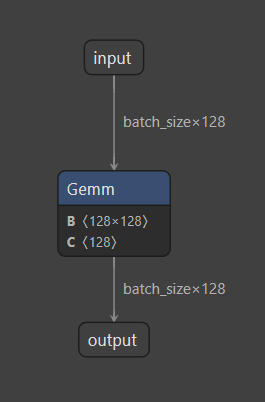

# Deep Understand about ONNX

## How ONNX store params

Create a simple onnx model with one `Conv2d` layer using `torch`

``` python
class SimpleModel(nn.Module):
    def __init__(self):
        super().__init__()
        self.layer = nn.Linear(128, 128)

    def forward(self, x):
        return self.layer(x)
```

Convert model to onnx and visualize in [netron](https://netron.app)



Get information about weight and bias with `read_onnx.py`

``` bash
layer.weight: (128, 128)
layer.bias: (128,)
```

And if you print in `numpy` format, you will get value of weight and bias